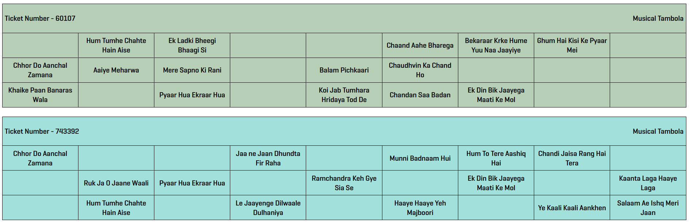

# Musical Tambola Ticket Generator

Python flask app to generate tickets for musical tambola, with song names on the ticket instead of numbers.

## Running the app

There are 2 ways to run this app and get your tickets:

For each method, you need to type the following in the browser to get the tickets:

`https://localhost:5000`

**Directly run the app without any arguments**

```angular2html
python main.py
```

This will generate 80 tickets by default.

---

**Specify the number of tickets as an argument**

```angular2html
python main.py 20
```

This will generate 20 tickets.

## Adding / Removing songs

You can change the 90 songs list [here](/songs.py)

**NOTE:** The list should contain 90 songs since that is a requirement for a tambola ticket.

There are no code safeguards if you don't fulfill this requirement.

## Downloading / Printing tickets

After running the app, you will have to open the web browser and type the following in the address bar:

`https://localhost:5000`

This will display all the tickets in the browser.

To print the tickets, simply use the browser print console (ctrl + p) to print the tickets as a PDF file.

Following considerations are used to have print-friendly tickets:
1. Tickets will be printed in landscape
2. Only 2 tickets will be printed in a page to avoid breaking tickets while printing

If you don't want the background color, you can simple use the browser print console and uncheck the background color option, no code changes needed.

## Demo Tickets



**GLHF !**